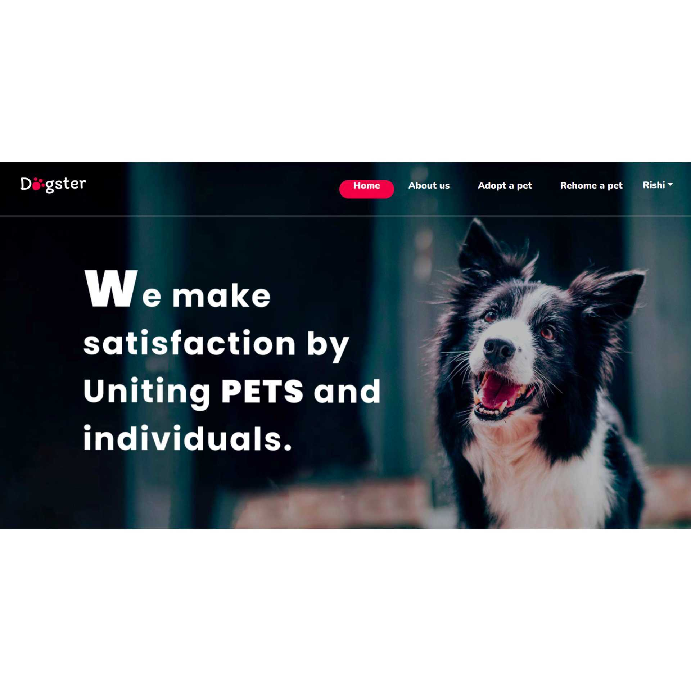

#### Heroku link: https://dogster-app.herokuapp.com/

#### sonarcloud link: https://sonarcloud.io/project/issues?resolved=false&types=BUG&id=vaishnavi-paramathma_Dogster&open=AYKqqnTTIhlpWSN3fGiF
#### github link: https://github.com/vaishnavi-paramathma/Dogster

###Final project ppt: https://docs.google.com/presentation/d/1pRe02vNBP9uwCIPtjY-6YJwxqRvioJj-B1AQx9rJYDg/edit#slide=id.g147b0e3164b_0_15

## Project name - Dogster
##### What is Dogster ?
 This is a application used for rehoming a pet in which user can login and post their dog and another user can see their post and connect with dog owner.

##### Why did I choose Dogster?
Reason why i choose this project is because i am from village if people are moving to another place so they are unable to take their dogs to new place so they simply leave their dogs, after the dog become homeless. So to find a solution for that i created a dogster where the dog owners can find a new lovely home for their dog

##### Features of Dogster :
  1.User authentication
  2.Adding a post(user)
  3.listing the post(user)
  4.search by city(user)
  5.User Wishlist
  6.user  deleting their post 

### 1.sign up
>All fields are required
 No fields can be nil
First name and Last name must contain atleast 3 characters (Validated with Name Regex Pattern)
Email id must be unique
Email id must be of the format 'example@gmail.com'
Password must contain atleast 7 characters 
Password and Confirm Password must be same
Password encrypted with a gem - 'bcrypt'

***
### 2.sign in 
>All fields are required
Email id and password should be authenticated - ('bcrypt' gem)

***
### 3.listing the post

 >All user can view all the post created
Agent can only view the tickets assigned to them

***
### 4.search by city
 >user can search dogs according to breed,state,city.

***
### 5.User wishlist
  >User can add a dog to their wishlist 
  They can also remove the dog from wishlist 

***
### 6.delete posts(user)
>The user who posted can only delete their post 

#### Libraries used
Active Storage

#### Future plans
>Admin persona
